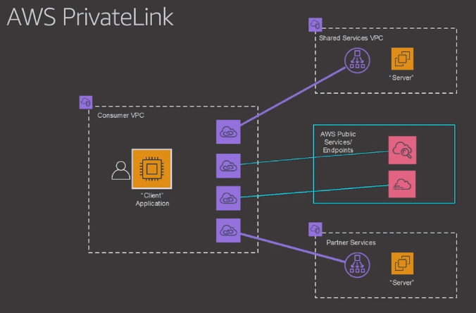
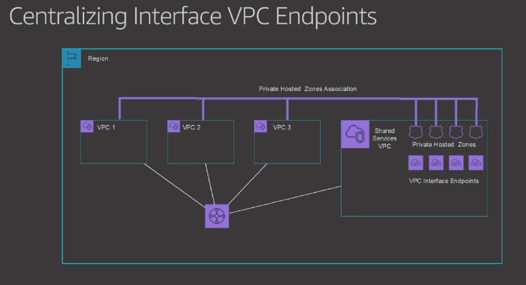

This CloudFormation template demonstrates a service-provider/service-consumer separation
and access management on AWS leveraging Service Endpoint, shared services VPC and Transit Gateway.

The solution demonstrates the approach touched upon by [Justin Davies](https://www.linkedin.com/in/mrjustind/)
and [Bhavin Desai](https://www.linkedin.com/in/bhavin-desai/) in their brilliant session
[The right AWS network architecture for the right reason (NET320)](https://youtu.be/Ot1kcQfUIdg?t=2288)
during AWS re:Invent 2019.
Also [Androski Spicer](https://www.linkedin.com/in/androski-spicer-72484a23/) explained
Interface Service Endpoints sharing in [From one to many: Evolving VPC design (ARC334)](https://youtu.be/qb-4PdLTsJs?t=3700).
I highly recommend to watch the videos.





# How to use it

1. Learn this CloudFormation template and watch the video.
1. Create stack. From my experience it takes around half an hour.
1. Kick TestFunction Lambda function and checkout its Log output.
Having string ```INFO <!DOCTYPE html>...``` there indicates that the service has been successfully
reached from service consumer's network. Hurray!
1. Delete the stack. Again, it may take up to 30 minutes.
1. Delete the log group on CloudWatch.
